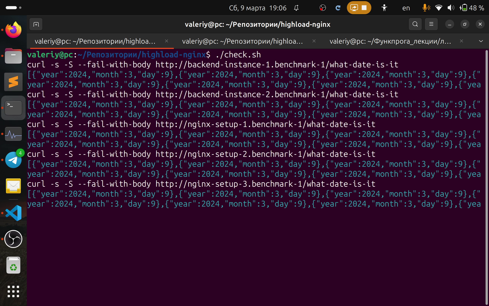

# highload-nginx


## Задание

1. На любом Web-фреймворке реализуйте сервис с двумя API-функциями:
    * Возвращает JSON-файл с 10 000 одинаковыми записями `{ "year", "month", "day" }` - текущая дата запроса
    * Возвращает JSON-файл с 10 000 одинаковыми записями `{ "name" }`, где имя `"name"` получено из POST-параметра формы запроса.
1. Настройте `nginx` для кэширования и балансировки.
1. Проведите замеры производительности при различных условиях (с проксированием и без него, и разные варианты одновременного количества подключений).
1. В репозиторий положить исходники Web-сервиса, конфигурационные файлы, и Markdown-отчет о замерах производительности.
1. После реализации необходимо продемонстрировать работоспособность на своей системе.

## Решение

Проведем два бенчмарка. Ниже будет видео-демонстрация работы бенчмарков и команды, как провести самому. Это не сложно, вам понадобится `docker-compose` и выполнить пару скриптов на баше.

### Первый бенчмарк
Бекэнд на go, уже настроен на кеширование (post запросы только не кешируем на nginx, ничего хорошего из этого не получится.. Можно мб настроить кеширование на клиенте, но на stackoverflow говорят, что это не особо поддерживается кем-либо). Такие результаты.

| Setup                     | Path             | Proxy caching | Balancing | Requests in batch | Requests per second |
| ------------------------- | ---------------- | ------------- | --------- | ----------------- | ------------------- |
| backend (single instance) | /what-date-is-it |               |           |                 1 |              701.33 |
| backend (single instance) | /what-date-is-it |               |           |                 6 |            2,359.69 |
| backend (single instance) | /what-is-my-name |               |           |                 1 |              739.61 |
| backend (single instance) | /what-is-my-name |               |           |                 6 |            2,306.52 |
| nginx-setup-1             | /what-date-is-it |         False | no        |                 1 |              486.55 |
| nginx-setup-1             | /what-date-is-it |         False | no        |                 6 |            1,808.97 |
| nginx-setup-1             | /what-is-my-name |         False | no        |                 1 |              490.19 |
| nginx-setup-1             | /what-is-my-name |         False | no        |                 6 |            1,833.28 |
| nginx-setup-2             | /what-date-is-it |         False | yes       |                 1 |              461.33 |
| nginx-setup-2             | /what-date-is-it |         False | yes       |                 6 |            1,886.78 |
| nginx-setup-2             | /what-is-my-name |         False | yes       |                 1 |              470.99 |
| nginx-setup-2             | /what-is-my-name |         False | yes       |                 6 |            1,819.01 |
| nginx-setup-2-withcache   | /what-date-is-it |          True | yes       |                 1 |            2,240.61 |
| nginx-setup-2-withcache   | /what-date-is-it |          True | yes       |                 6 |            3,730.59 |
| nginx-setup-2-withcache   | /what-is-my-name |         False | yes       |                 1 |              482.13 |
| nginx-setup-2-withcache   | /what-is-my-name |         False | yes       |                 6 |            1,833.80 |
| nginx-setup-3             | /what-date-is-it |         False | uneven    |                 1 |              470.00 |
| nginx-setup-3             | /what-date-is-it |         False | uneven    |                 6 |            1,793.93 |
| nginx-setup-3             | /what-is-my-name |         False | yes       |                 1 |              471.10 |
| nginx-setup-3             | /what-is-my-name |         False | yes       |                 6 |            1,761.57 |
|                           |                  |               |           |                   |                     |


#### Выводы

##### Балансировка
Go [многопоточный сам по себе](https://stackoverflow.com/a/39246575) и запускает N системных потоков, где N -- количество ядер (виртуальных процессоров). И каждый запрос создает горутину с обработчиком пути запроса. Имеем такой тредпул из N системных потоков, на котором крутятся корутины, которые называются в Go горутинами.
В эти N не входят потоки, которые ожидают возврата из системных вызовов, их может быть и больше.

Так вот. Один instance бекэнда в нашем случае и сам в состоянии утилизировать все доступные ресурсы (каждая горутина из шести получит по своему потоку ОС, поскольку GOMAXPROCS = количество ядер на моем ПК = 12 > 6, go позволит себе заспавнить 12 потоков ОС для горутин, каждая горутина попадет на свой поток ОС). Nginx только мешает, занимает время обработки запроса.

Если детальнее сказать, пусть `ab` пошлет 6 запросов и будет ждать их ответа, прежде чем послать следующие. В случае `backend-instance`, запустится шесть горутин, которые  сядут на шесть потоков ОС, они спокойно будут исполняться на шести ядрах моего компьютера (у меня 12 ядер, они смогут работать одновременно). Т.е. задействуется шесть ядер.

Если добавится nginx с балансировкой, то каждый из instance-ов получит по 3 запроса, каждый задействует по три ядра. Ничего не поменялось! В работе три ядра, так еще и nginx время забрал. Вот если один backend-instance не задействует все ресурсы, скажем, есть несколько backend instanc-ов и они живут на разных машинах -- результат будет. Т.к. балансировка тогда -- способ включить в работу большее количество ресурсов, которое без нее backend не задействует.

##### Кеширование

Видно, что польза есть. Ускорение в полтора раза.


### Второй бенчмарк
Доступные ресурсы -- шесть ядер. Каждый instance бекэнда может задействовать два. В реальной жизни -- это разные машины по два (в скобочках, 20) ядра. Теперь балансировка только позволит больше ресурсов включить в работу (главное, чтобы накладные расходы на балансировку, пересылки запросов и прочее, не мешали получить выгоду).

| Setup                     | Path             | Proxy caching | Balancing | Requests in batch | Requests per second |
| ------------------------- | ---------------- | ------------- | --------- | ----------------- | ------------------- |
| backend (single instance) | /what-date-is-it |               |           |                 1 |              129.97 |
| backend (single instance) | /what-date-is-it |               |           |                 6 |              268.17 |
| backend (single instance) | /what-is-my-name |               |           |                 1 |              224.05 |
| backend (single instance) | /what-is-my-name |               |           |                 6 |              481.00 |
| nginx-setup-1             | /what-date-is-it |         False | no        |                 1 |              113.12 |
| nginx-setup-1             | /what-date-is-it |         False | no        |                 6 |              259.08 |
| nginx-setup-1             | /what-is-my-name |         False | no        |                 1 |              182.51 |
| nginx-setup-1             | /what-is-my-name |         False | no        |                 6 |              474.09 |
| nginx-setup-2             | /what-date-is-it |         False | yes       |                 1 |              117.24 |
| nginx-setup-2             | /what-date-is-it |         False | yes       |                 6 |              514.23 |
| nginx-setup-2             | /what-is-my-name |         False | yes       |                 1 |              185.94 |
| nginx-setup-2             | /what-is-my-name |         False | yes       |                 6 |              815.32 |
| nginx-setup-2-withcache   | /what-date-is-it |          True | yes       |                 1 |            2,240.26 |
| nginx-setup-2-withcache   | /what-date-is-it |          True | yes       |                 6 |            3,893.27 |
| nginx-setup-2-withcache   | /what-is-my-name |         False | yes       |                 1 |              184.91 |
| nginx-setup-2-withcache   | /what-is-my-name |         False | yes       |                 6 |              830.17 |
| nginx-setup-3             | /what-date-is-it |         False | uneven    |                 1 |              114.54 |
| nginx-setup-3             | /what-date-is-it |         False | uneven    |                 6 |              356.99 |
| nginx-setup-3             | /what-is-my-name |         False | yes       |                 1 |              182.87 |
| nginx-setup-3             | /what-is-my-name |         False | yes       |                 6 |              617.24 |
|                           |                  |               |           |                   |                     |


#### Выводы

##### Балансировка

Совсем другой разговор. Ускорение в два раза! Т.е. буквально балансировка включает в работу дополнительные ресурсы. Так и бывает в реальной жизни.

Еще в реальной жизни точки входа в api -- instance-ы nginx -- тоже балансируются с помощью dns. Т.к. они могут перегрузиться уже сами, когда отбалансировать можно на большое количество instance-ов бекэнда, но пропускной способности самих систем с nginx уже не хватает. И нужно балансировать уже по этим системам.

Но зато мы пришли к тому, что клиенты сами себя балансируют. На этом проблемы с пропускной способностью должны кончаться. Т.к. уже не нужно балансировать балансировщики -- клиенты уже являются распределенной системой.

##### Кеширование

todo: написать!

## Видео-демонстрация


[comment]: https://stackoverflow.com/a/29862696

[](media/video.m3u8 "Видео-демонстрация -- нажмите, чтобы посмотреть!")

Ранее была ссылка на файл, но github запрещает файлы размером более 100MB.
Способы посмотреть видео.

```bash
cd highload-nginx
vlc media/video.m3u8
```

```bash
cd highload-nginx
ffplay media/video.m3u8
```

## Инструкции

Все предельно просто: запустить в одном терминале (или вкладке) `docker-compose up`, затем `./benchmark-1.sh` и `./benchmark-2.sh`. Это будут результаты первого и второго бенчмарка соответственно.
